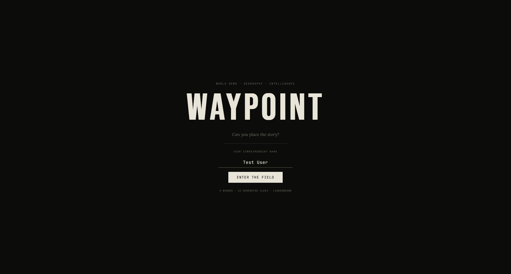
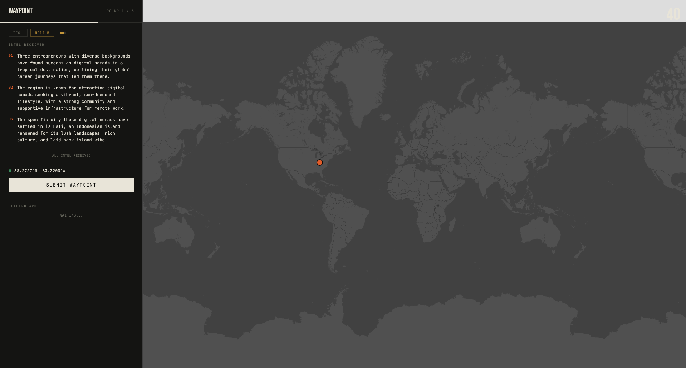
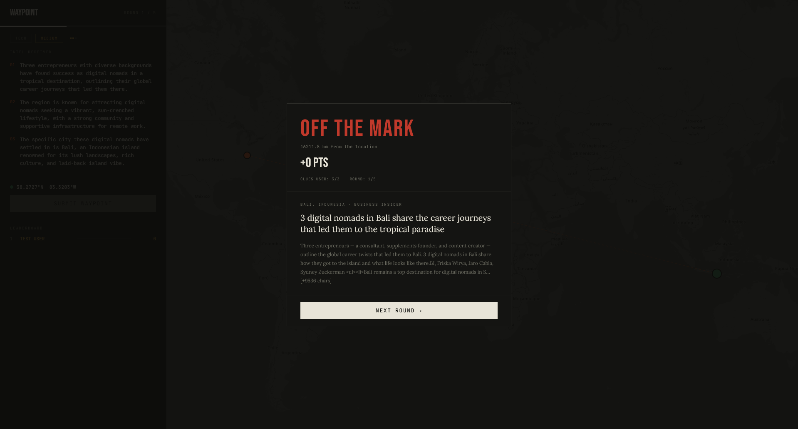

# Waypoint

**World News • Geography • Intelligence**

Waypoint is a sleek, intelligence-themed geography guessing game. Test your global awareness by pinpointing the locations of real, breaking news stories on an interactive world map.



---

## 🎯 How to Play

1. **Enter the Field:** Start your shift as a global correspondent. You'll face 5 rounds of breaking news from around the world.
2. **Analyze the Intel:** You are given up to 3 AI-generated clues describing a recent news event.
   - *Clue 01* is vague (focusing on the event).
   - *Clue 03* gives highly specific local details to help you narrow down the city.
3. **Drop the Pin:** Click anywhere on the dark-mode interactive map to submit your guess for where the story took place.
4. **Get the Verdict:** See how close you were. An orange line is drawn between your guess (orange pin) and the actual location (green pin).



## 🏅 Scoring System

Points are calculated based on your geographic accuracy (using the Haversine distance formula), the time it took you to answer, and how many clues you needed to reveal.

- **Verdicts:** **PINPOINT** / **ON TARGET** / **CLOSE** / **OFF THE MARK** depending on your distance from the actual event.
- **Modifiers:**
  - **Clues Used:** Using fewer clues gives a higher multiplier (1 Clue = 1.0x, 2 Clues = 0.7x, 3 Clues = 0.45x).
  - **Speed:** Quick guesses under 15 seconds earn a speed bonus modifier.



---

## 🛠 Technical Architecture

Waypoint is built with a modern, microservice-inspired architecture consolidated into a unified backend, focusing on performance, caching, and AI integrations.

### Frontend

- **React & Vite:** Fast, modern frontend framework allowing quick iterations.
- **Leaflet Map:** Powers the interactive, dark-themed world map (without Google Maps overhead) and pin-dropping mechanics.
- **State Management:** Custom React hooks (`useGame`) manage the game loop, timer, and score progression completely independent from backend renders.

### Backend APIs

- **FastAPI (Python):** High-performance, asynchronous backend routing structure.
- **SQLite Database:** Operates in Write-Ahead Logging (WAL) mode to store anonymous "Wire Room" pin drops and daily player statistics asynchronously, without blocking the main game flow.
- **NewsAPI Integration:** Automatically fetches top global headlines from the last 24 hours.

### AI Intelligence Layer (LLMs)

- **Dynamic AI Provider Options:** Supports **AWS Bedrock (Claude 3 Haiku)** or **OpenRouter (Hunter Alpha)** to process raw news articles.
- **Geocoding & Clue Generation:** The LLM acts as the intelligence agent, extracting exact latitude/longitude coordinates from raw text, and dynamically generating the 3 progressive, redacted clues on the fly without leaking the answer.
- **Daily JSON Caching:** To minimize API costs and ensure blazing-fast load times, fetched stories, extracted locations, and generated clues are rigidly cached locally in JSON payloads per day.

---

## 💻 Local Development

To run this project locally, you will need a few API keys (NewsAPI and an AI Provider).

**1. Clone the repository**

```bash
git clone https://github.com/your-username/waypoint.git
cd waypoint
```

**2. Backend Setup**
Enter the `backend` directory, install the Python requirements, and set up your environment variables.

```bash
cd backend
pip install -r requirements.txt
```

Create a `.env` file in the `backend` folder:

```env
NEWS_API_KEY=your_newsapi_key
ALLOWED_ORIGINS=http://localhost:5173
PORT=8000

# AI Provider Toggle: choose 'bedrock' or 'openrouter'
AI_PROVIDER=openrouter

# OpenRouter config
OPENROUTER_API_KEY=your_openrouter_key
OPENROUTER_MODEL=openrouter/hunter-alpha

# Bedrock config (if using AWS)
AWS_REGION=us-east-1
BEDROCK_MODEL_ID=anthropic.claude-3-haiku-20240307-v1:0
```

Start the backend server on port 8000:

```bash
uvicorn main:app --port 8000 --reload
```

**3. Frontend Setup**
In a new terminal window, enter the `frontend` directory, install dependencies, and start Vite:

```bash
cd frontend
pnpm install
pnpm dev
```

Navigate to `http://localhost:5173` to start playing!
